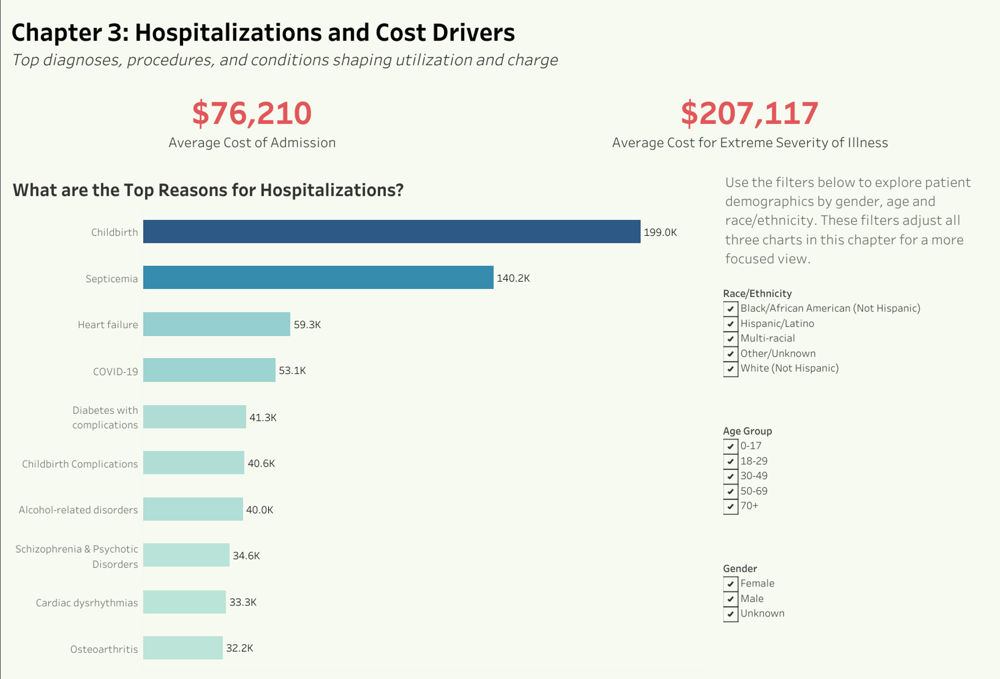

<p align="center">
  
</p>

# 🏥New York Inpatient Care (SPARCS 2022) — SQL → Tableau Public Health Dashboard

**Live dashboard:** 📊[NY Inpatient Analysis (Tableau Public)](https://public.tableau.com/views/NYHospitalAnalysis/Dashboard5?:language=en-US&:sid=&:redirect=auth&:display_count=n&:origin=viz_share_link)

Dahboard Preview


## 📌Project Overview
This project analyzes **New York State inpatient hospitalizations (SPARCS, 2022)** to uncover patterns in **who is hospitalized, what conditions drive admissions and charges, where patients are located,** and **how costs vary**.
All raw data was cleaned and transformed in **SQL**, then published into **Tableau Public** for interactive analysis. The aim is to surface **public-health insights** and equity-minded context—not just totals.
**Primary data source:** Hospital Inpatient Discharges (SPARCS De-Identified), 2022

## ⚙️Pipeline (SQL → Tableau)

### 1) Schema (`Schema.sql`)
- Fact table: **`discharges`** (patient demographics, admission/discharge, **primary_diagnosis**, **total_charges**, **length_of_stay**, **payer**, **facility_id**, **admission_date**, **race_ethnicity**, **gender**, **age**).
- Dimensions: **`facilities`** (`facility_id`, `facility_name`, `county_code`), **`counties`** (`county_code`, `county_name`), **`payers`** (normalized payer categories).
- Keys: `discharges.facility_id → facilities.facility_id`, `facilities.county_code → counties.county_code`.
- Performance: create **BTREE indexes** on `primary_diagnosis`, `facility_id`, `county_code`, `admission_date`, plus **low-cardinality** filters (`gender`, `race_ethnicity`) as needed.

### 2) Cleaning & Standardization (`Cleaning.sql`)
- Convert **Total Charges** → `DECIMAL(12,2)`; **Length of Stay** → `INTEGER`.
- Normalize **Race/Ethnicity** and **Gender** labels to consistent buckets.
- Derive **Age Groups** via `CASE WHEN` (0–17, 18–29, 30–44, 45–64, 65+).
- Handle anomalies (e.g., `length_of_stay <= 0` → `NULL`).
- Optional: deduplicate facilities by fuzzy/standardized names before counting distinct hospitals.

### 3) Analysis (`Analysis.sql`)
- Use **JOINs**, **GROUP BY**, and **window functions** to produce extracts for Tableau:
  - **Admissions by primary_diagnosis** (+ average charges, average LOS).
  - **Admissions by county** and **Admissions per Hospital** (burden).
  - **Demographic splits**: gender, race/ethnicity, age group.
  - **Payer mix** shares.
- Optional engineering touches:
  - Materialize heavy aggregations into **summary tables**.
  - **CTEs** for readability; **indexes** on summary keys for fast extracts.

### 4) Visualization (Tableau Public)
- Ranked bars: **Admissions by Primary Diagnosis**.
- Bars/labels: **Average Charges** and **Average LOS** by diagnosis.
- **Map by County** for admissions.
- **Admissions per Hospital (burden)** bar view.
- Global filters: **Gender** and **Race/Ethnicity**.


## 🔍What the dashboard shows

- **Demographics:** Women are hospitalized ~9% more than men; race/ethnicity distribution is diverse with visible disparities.
- **Age:** Admissions rise with age; **18–29** group has fewer admissions but **higher average charges per stay** in several categories.
- **Diagnosis & Cost:** High-volume diagnoses differ from **high-charge** or **long-stay** diagnoses.
- **Geography:** NYC and surrounding counties dominate totals; some counties show **high admissions per hospital** indicating potential strain.
- **Payers:** Medicare/Medicaid dominate statewide coverage; commercial remains substantial.


## Data notes & limitations

- **Charges reflect the entire stay**, not only the admitting diagnosis; complexity/procedures can raise totals.
- **Unknown/Other** categories (race/ethnicity, payer) can bias distributions.
- **Admissions per Hospital** uses **distinct facility names**; naming inconsistencies can affect counts.
- Rare conditions at the county level can produce unstable small-number patterns.

## Attribution

- **Data:** NYS DOH — SPARCS Hospital Inpatient Discharges (De-Identified), 2022
- **Dashboard:** Tableau Public — NY Hospital Analysis

---

## 👤 Author
**Ashik Rahman**
- [LinkedIn](https://www.linkedin.com/in/ashik-rahman-998364379)
- [GitHub](https://github.com/ashhik96)

---

## 📜Example SQL Queries 

```MySQL Workbench (MySQL 8.0+) — Key, complex examples

/* 1) Performance prep: high-impact indexes for joins, grouping, and filters */
CREATE INDEX ix_discharges_admission_date ON discharges (admission_date);
CREATE INDEX ix_discharges_primary_dx     ON discharges (primary_diagnosis);
CREATE INDEX ix_discharges_facility_id    ON discharges (facility_id);
CREATE INDEX ix_facilities_county_code    ON facilities (county_code);
-- Optional composite for slicers (helps WHERE and GROUP BY on these dims)
CREATE INDEX ix_discharges_gender_race    ON discharges (gender, race_ethnicity);


/* 2) Admissions & Avg Charges/LOS by diagnosis + rank (window function) */
WITH dx AS (
  SELECT
      primary_diagnosis,
      COUNT(*)                                  AS total_admissions,
      ROUND(AVG(total_charges), 2)              AS avg_charges,
      ROUND(AVG(length_of_stay), 1)             AS avg_los
  FROM discharges
  GROUP BY primary_diagnosis
)
SELECT
    primary_diagnosis,
    total_admissions,
    avg_charges,
    avg_los,
    RANK() OVER (ORDER BY total_admissions DESC) AS diagnosis_rank
FROM dx
ORDER BY diagnosis_rank;


/* 3) County burden: Admissions per Hospital + statewide percentile (joins + window) */
WITH burden AS (
  SELECT
      c.county_name,
      COUNT(*)                                              AS total_admissions,
      COUNT(DISTINCT f.facility_id)                         AS hospital_count,
      ROUND(COUNT(*) * 1.0 / NULLIF(COUNT(DISTINCT f.facility_id), 0), 2) AS adm_per_hosp
  FROM discharges d
  JOIN facilities f ON d.facility_id = f.facility_id
  JOIN counties   c ON f.county_code  = c.county_code
  GROUP BY c.county_name
)
SELECT
    county_name,
    total_admissions,
    hospital_count,
    adm_per_hosp AS admissions_per_hospital,
    PERCENT_RANK() OVER (ORDER BY adm_per_hosp) AS burden_percentile
FROM burden
ORDER BY admissions_per_hospital DESC, total_admissions DESC;


/* 4) Top 5 diagnoses by county (partitioned ranking for local “Top-N”) */
WITH county_dx AS (
  SELECT
      c.county_name,
      d.primary_diagnosis,
      COUNT(*) AS admissions
  FROM discharges d
  JOIN facilities f ON d.facility_id = f.facility_id
  JOIN counties   c ON f.county_code  = c.county_code
  GROUP BY c.county_name, d.primary_diagnosis
),
ranked AS (
  SELECT
      county_name,
      primary_diagnosis,
      admissions,
      ROW_NUMBER() OVER (PARTITION BY county_name ORDER BY admissions DESC) AS rn
  FROM county_dx
)
SELECT county_name, primary_diagnosis, admissions
FROM ranked
WHERE rn <= 5
ORDER BY county_name, admissions DESC;
